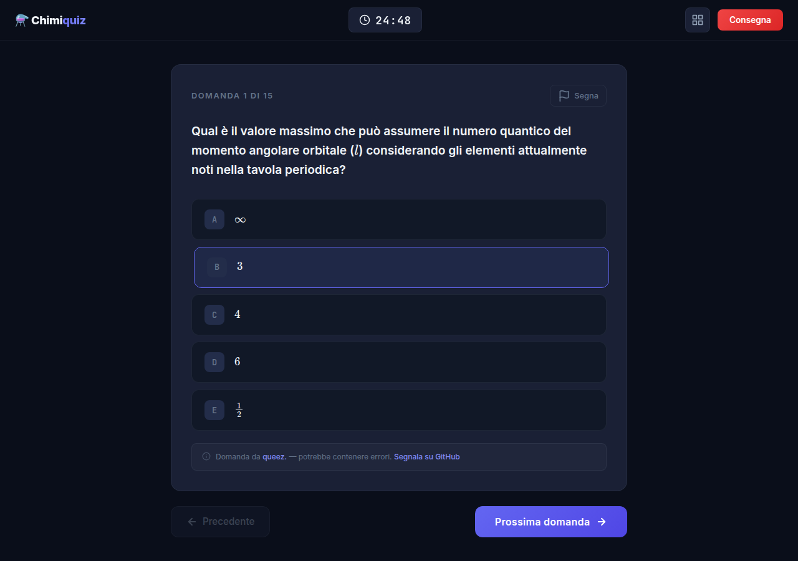

# Chimiquiz

Chimiquiz simula il test di Chimica del Politecnico di Torino: 15 domande a risposta multipla, 25 minuti, punteggio su 9. Le domande arrivano da [Poliquiz](https://www.poliquiz.it) e dal banco di chimica di [queez.](https://queez.org), più di 1.300 in tutto.

Lo usi gratis dal browser, senza account e senza installare niente: [supertost100.github.io/chimiquiz](https://supertost100.github.io/chimiquiz/).



## Cosa fa

1. **Estrae 15 domande.** Evita quelle viste nelle ultime sessioni: ricorda le ultime 256 domande, quindi il ciclo si rinnova dopo circa 17 test. Le domande presenti in entrambi i banchi le toglie `data/global-blacklist.json`.
2. **Cronometra il test.** Il timer parte da 25 minuti e allo scadere il test si consegna da solo. La modalità DSA aggiunge il 30% di tempo (32 minuti e 30 secondi).
3. **Ti lascia muovere tra le domande.** La griglia mostra quali hai risposto, saltato o segnato con la bandierina. Dalla tastiera: frecce per cambiare domanda, da `1` a `5` per scegliere un'opzione, `F` per la bandierina.
4. **Corregge come l'esame.** Ogni risposta giusta vale +0,60, ogni errata -0,12, quelle non date 0. La sufficienza è 6/9, ma da 5,5 in su il test risulta superato perché il voto viene arrotondato.
5. **Ti fa rivedere gli errori.** Il riepilogo mostra ogni domanda con la correzione. Per una spiegazione, apre ChatGPT, Claude o Gemini in una nuova scheda con il prompt già scritto.

Se una domanda è sbagliata, "Cambia domanda" la sostituisce e non te la ripropone più. Le domande di Poliquiz si segnalano su poliquiz.it; quelle di queez. con [questo modulo](https://github.com/SuperTost100/chimiquiz/issues/new?template=domanda-queez.yml) o con una pull request su `data/queez-chimica.json`.

## Dati e privacy

Cronologia, domande escluse e modalità DSA restano nel `localStorage` del browser. Il sito scarica le domande da `api.poliquiz.it` e conta i test completati con [GoatCounter](https://www.goatcounter.com), che non usa cookie. Il numero di test completati compare in home.

## Avvio in locale

È un sito statico (`index.html`, `index.css`, `app.js`), senza build. Serve un server qualsiasi, perché il browser non carica i file JSON da `file://`:

```bash
git clone https://github.com/SuperTost100/chimiquiz.git
cd chimiquiz
python3 -m http.server 8000     # poi apri http://localhost:8000
```

Dalla console del browser:

| Comando                        | Cosa fa                                                         |
| ------------------------------ | --------------------------------------------------------------- |
| `chimiquiz.stats()`            | Domande caricate, cronologia recente e domande escluse          |
| `chimiquiz.resetBlacklist()`   | Rimette in gioco le domande che hai escluso                     |
| `chimiquiz.resetRecent()`      | Svuota la cronologia, così tutte le domande tornano disponibili |
| `chimiquiz.setDsa(true/false)` | Attiva o disattiva la modalità DSA                              |

Il sito è pubblicato con GitHub Pages dal branch `main`. Quando esce una versione nuova (`APP_VERSION` in `app.js`), chi ha la pagina aperta vede un banner per ricaricarla.

## Licenza

Il codice è sotto [Apache 2.0](LICENSE). Le domande di queez. in `data/queez-chimica.json` non lo sono: appartengono a [queez.](https://queez.org) e per riusarle serve il loro consenso. Le domande di Poliquiz restano sul loro server e Chimiquiz le legge dalla loro API.
